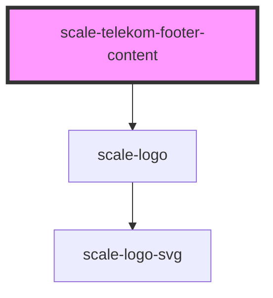

# scale-telekom-footer

<!-- Auto Generated Below -->

## Shadow Parts

| Part                     | Description |
| ------------------------ | ----------- |
| `"app-logo"`             |             |
| `"footer-container"`     |             |
| `"logo-container"`       |             |
| `"navigation-container"` |             |
| `"navigation-links"`     |             |
| `"notice-container"`     |             |

## Dependencies

### Depends on

- [scale-logo](../logo)

### Graph

----------------------------------------------

*Built with [StencilJS](https://stenciljs.com/)*
