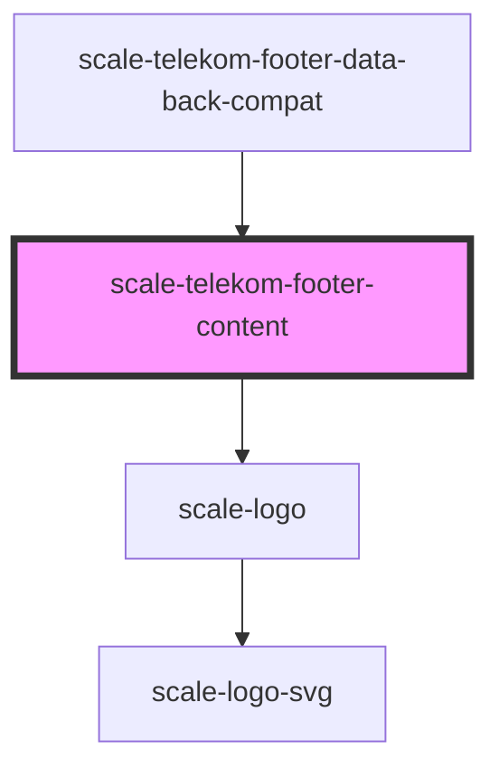

# scale-telekom-footer

<!-- Auto Generated Below -->

## Properties

| Property        | Attribute         | Description                        | Type      | Default                 |
| --------------- | ----------------- | ---------------------------------- | --------- | ----------------------- |
| `logoHideTitle` | `logo-hide-title` | (optional) set logo specific title | `boolean` | `false`                 |
| `logoHref`      | `logo-href`       | (optional) Logo link               | `string`  | `'javascript:void(0);'` |
| `logoTitle`     | `logo-title`      | (optional) set logo specific title | `string`  | `'Telekom Logo'`        |

## Shadow Parts

| Part           | Description |
| -------------- | ----------- |
| `"app-logo"`   |             |
| `"base"`       |             |
| `"body"`       |             |
| `"logo"`       |             |
| `"navigation"` |             |
| `"notice"`     |             |

## Dependencies

### Used by

 - [scale-telekom-footer-data-back-compat](../telekom-footer-data-back-compat)

### Depends on

- [scale-logo](../logo)

### Graph

----------------------------------------------

*Built with [StencilJS](https://stenciljs.com/)*
