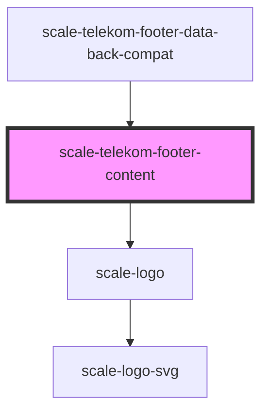

# scale-telekom-footer

<!-- Auto Generated Below -->

## Shadow Parts

| Part           | Description |
| -------------- | ----------- |
| `"app-logo"`   |             |
| `"base"`       |             |
| `"body"`       |             |
| `"logo"`       |             |
| `"navigation"` |             |
| `"notice"`     |             |

## Dependencies

### Used by

 - [scale-telekom-footer-data-back-compat](../telekom-footer-data-back-compat)

### Depends on

- [scale-logo](../logo)

### Graph

----------------------------------------------

*Built with [StencilJS](https://stenciljs.com/)*
