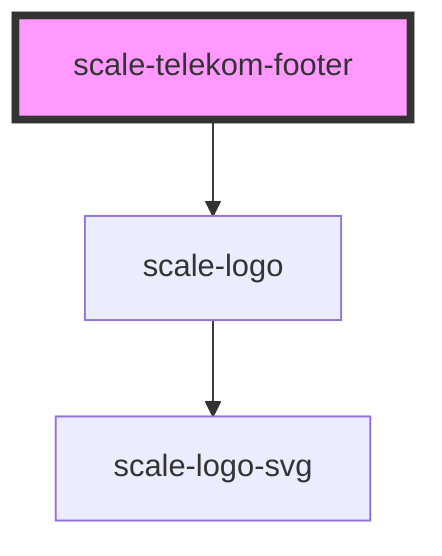

# scale-telekom-footer

<!-- Auto Generated Below -->

## Properties

| Property  | Attribute | Description | Type                   | Default      |
| --------- | --------- | ----------- | ---------------------- | ------------ |
| `variant` | `variant` |             | `"slim" \| "standard"` | `'standard'` |

## Shadow Parts

| Part         | Description |
| ------------ | ----------- |
| `"app-logo"` |             |

## Dependencies

### Depends on

- [scale-logo](../logo)

### Graph

----------------------------------------------

*Built with [StencilJS](https://stenciljs.com/)*
