# scale-telekom-header-data-back-compat

<!-- Auto Generated Below -->

## Properties

| Property           | Attribute         | Description | Type                 | Default     |
| ------------------ | ----------------- | ----------- | -------------------- | ----------- |
| `activeRouteId`    | `active-route-id` |             | `string`             | `undefined` |
| `addonNavigation`  | --                |             | `AddOnNavigation[]`  | `undefined` |
| `appName`          | `app-name`        |             | `string`             | `undefined` |
| `appNameClick`     | `app-name-click`  |             | `any`                | `undefined` |
| `appNameLink`      | `app-name-link`   |             | `string`             | `undefined` |
| `iconNavigation`   | --                |             | `IconNavigation[]`   | `undefined` |
| `logoHideTitle`    | `logo-hide-title` |             | `boolean`            | `undefined` |
| `logoHref`         | `logo-href`       |             | `string`             | `undefined` |
| `logoTitle`        | `logo-title`      |             | `string`             | `undefined` |
| `mainNavigation`   | --                |             | `MainNavigation[]`   | `undefined` |
| `sectorNavigation` | --                |             | `SectorNavigation[]` | `undefined` |
| `userNavigation`   | --                |             | `UserNavigation[]`   | `undefined` |

## Dependencies

### Depends on

- [scale-telekom-header](../telekom-header)
- [scale-telekom-nav-list](../telekom-nav-list)
- [scale-telekom-nav-item](../telekom-nav-item)
- [scale-telekom-nav-flyout](../telekom-nav-flyout)
- [scale-telekom-mega-menu](../telekom-mega-menu)
- [scale-telekom-mega-menu-column](../telekom-mega-menu)
- [scale-menu-flyout](../../menu-flyout)
- [scale-badge](../../badge)
- [scale-icon-user-file-user](../../icons/user-file-user)
- [scale-menu-flyout-list](../../menu-flyout-list)
- [app-navigation-user-menu](../app-navigation-user-menu)
- [scale-telekom-mobile-flyout-canvas](../telekom-mobile-flyout-canvas)
- [scale-icon-action-menu](../../icons/action-menu)
- [scale-telekom-mobile-menu](../telekom-mobile-menu)
- [scale-telekom-mobile-menu-item](../telekom-mobile-menu-item)
- [scale-icon](../../icon)

### Graph

```mermaid
graph TD;
  scale-telekom-header-data-back-compat --> scale-telekom-header
  scale-telekom-header-data-back-compat --> scale-telekom-nav-list
  scale-telekom-header-data-back-compat --> scale-telekom-nav-item
  scale-telekom-header-data-back-compat --> scale-telekom-nav-flyout
  scale-telekom-header-data-back-compat --> scale-telekom-mega-menu
  scale-telekom-header-data-back-compat --> scale-telekom-mega-menu-column
  scale-telekom-header-data-back-compat --> scale-menu-flyout
  scale-telekom-header-data-back-compat --> scale-badge
  scale-telekom-header-data-back-compat --> scale-icon-user-file-user
  scale-telekom-header-data-back-compat --> scale-menu-flyout-list
  scale-telekom-header-data-back-compat --> app-navigation-user-menu
  scale-telekom-header-data-back-compat --> scale-telekom-mobile-flyout-canvas
  scale-telekom-header-data-back-compat --> scale-icon-action-menu
  scale-telekom-header-data-back-compat --> scale-telekom-mobile-menu
  scale-telekom-header-data-back-compat --> scale-telekom-mobile-menu-item
  scale-telekom-header-data-back-compat --> scale-icon
  scale-telekom-header --> scale-logo
  scale-logo --> scale-logo-svg
  scale-telekom-mega-menu-column --> scale-icon-navigation-right
  app-navigation-user-menu --> scale-button
  app-navigation-user-menu --> scale-icon
  scale-telekom-mobile-flyout-canvas --> scale-icon-action-close
  scale-telekom-mobile-menu --> scale-icon-navigation-left
  scale-telekom-mobile-menu-item --> scale-icon-navigation-right
  style scale-telekom-header-data-back-compat fill:#f9f,stroke:#333,stroke-width:4px
```

----------------------------------------------

*Built with [StencilJS](https://stenciljs.com/)*
