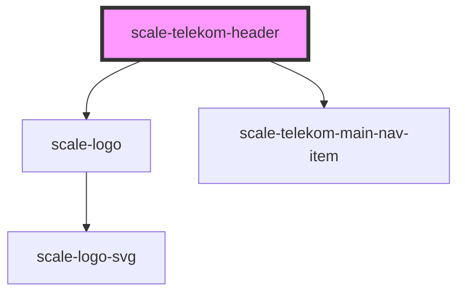

# scale-telekom-header

<!-- Auto Generated Below -->

## Properties

| Property              | Attribute               | Description | Type     | Default             |
| --------------------- | ----------------------- | ----------- | -------- | ------------------- |
| `mainNavigation`      | `main-navigation`       |             | `any`    | `undefined`         |
| `mainNavigationLabel` | `main-navigation-label` |             | `string` | `'Main Navigation'` |

## Shadow Parts

| Part           | Description |
| -------------- | ----------- |
| `"base"`       |             |
| `"main-nav"`   |             |
| `"portalname"` |             |

## Dependencies

### Depends on

- [scale-logo](../logo)
- [scale-telekom-main-nav-item](../telekom-main-nav-item)

### Graph

----------------------------------------------

*Built with [StencilJS](https://stenciljs.com/)*
