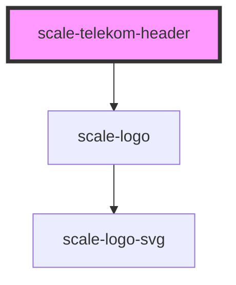

# scale-telekom-header

<!-- Auto Generated Below -->

## Properties

| Property         | Attribute         | Description | Type     | Default     |
| ---------------- | ----------------- | ----------- | -------- | ----------- |
| `appName`        | `app-name`        |             | `string` | `undefined` |
| `appNameClick`   | `app-name-click`  |             | `any`    | `undefined` |
| `appNameLink`    | `app-name-link`   |             | `string` | `undefined` |
| `mainNavigation` | `main-navigation` |             | `any`    | `undefined` |

## Shadow Parts

| Part                | Description |
| ------------------- | ----------- |
| `"app-logo"`        |             |
| `"app-name-text"`   |             |
| `"body"`            |             |
| `"bottom-app-name"` |             |
| `"bottom-bar"`      |             |
| `"bottom-body"`     |             |
| `"container"`       |             |
| `"top-app-name"`    |             |
| `"top-bar"`         |             |
| `"top-body"`        |             |

## Dependencies

### Depends on

- [scale-logo](../logo)

### Graph

----------------------------------------------

*Built with [StencilJS](https://stenciljs.com/)*
