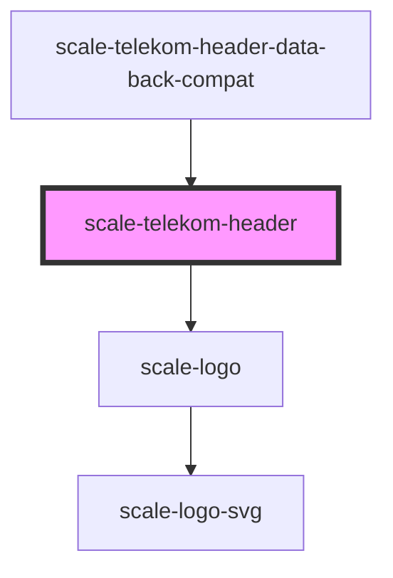

# scale-telekom-header

<!-- Auto Generated Below -->

## Properties

| Property                    | Attribute                      | Description | Type     | Default                      |
| --------------------------- | ------------------------------ | ----------- | -------- | ---------------------------- |
| `appName`                   | `app-name`                     |             | `string` | `undefined`                  |
| `appNameClick`              | `app-name-click`               |             | `any`    | `undefined`                  |
| `appNameLink`               | `app-name-link`                |             | `string` | `undefined`                  |
| `languageSwitcherAriaLabel` | `language-switcher-aria-label` |             | `string` | `'Language switcher'`        |
| `mainNavAriaLabel`          | `main-nav-aria-label`          |             | `string` | `'Main navigation'`          |
| `metaNavAriaLabel`          | `meta-nav-aria-label`          |             | `string` | `'Meta navigation'`          |
| `metaNavExternalAriaLabel`  | `meta-nav-external-aria-label` |             | `string` | `'External meta navigation'` |
| `type`                      | `type`                         |             | `string` | `'default'`                  |

## Shadow Parts

| Part                  | Description |
| --------------------- | ----------- |
| `"app-logo"`          |             |
| `"app-name-text"`     |             |
| `"body"`              |             |
| `"bottom-app-name"`   |             |
| `"bottom-bar"`        |             |
| `"bottom-body"`       |             |
| `"container"`         |             |
| `"fixed-wrapper"`     |             |
| `"lang-switcher"`     |             |
| `"main-nav"`          |             |
| `"meta-nav"`          |             |
| `"meta-nav-external"` |             |
| `"top-app-name"`      |             |
| `"top-bar"`           |             |
| `"top-body"`          |             |

## Dependencies

### Used by

 - [scale-telekom-header-data-back-compat](../telekom-header-data-back-compat)

### Depends on

- [scale-logo](../logo)

### Graph

----------------------------------------------

*Built with [StencilJS](https://stenciljs.com/)*
