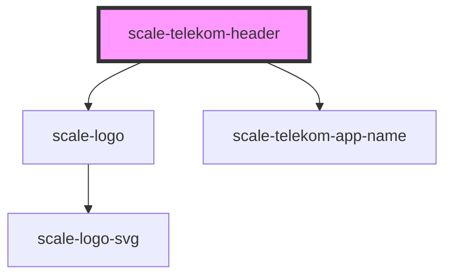

# scale-telekom-header

<!-- Auto Generated Below -->

## Properties

| Property         | Attribute         | Description | Type     | Default     |
| ---------------- | ----------------- | ----------- | -------- | ----------- |
| `appName`        | `app-name`        |             | `string` | `undefined` |
| `appNameClick`   | `app-name-click`  |             | `any`    | `undefined` |
| `appNameLink`    | `app-name-link`   |             | `string` | `undefined` |
| `mainNavigation` | `main-navigation` |             | `any`    | `undefined` |

## Shadow Parts

| Part                       | Description |
| -------------------------- | ----------- |
| `"app-logo"`               |             |
| `"app-name"`               |             |
| `"app-name-and-base-menu"` |             |
| `"app-name-extended"`      |             |
| `"base-menu"`              |             |
| `"container"`              |             |
| `"extended-menu"`          |             |
| `"extended-menu-left"`     |             |
| `"extended-menu-right"`    |             |
| `"horizontal-menus"`       |             |

## Dependencies

### Depends on

- [scale-logo](../logo)
- [scale-telekom-app-name](../telekom-app-name)

### Graph

----------------------------------------------

*Built with [StencilJS](https://stenciljs.com/)*
