# scale-telekom-header

<!-- Auto Generated Below -->

## Properties

| Property           | Attribute           | Description | Type     | Default     |
| ------------------ | ------------------- | ----------- | -------- | ----------- |
| `activeRouteId`    | `active-route-id`   |             | `string` | `undefined` |
| `addonNavigation`  | `addon-navigation`  |             | `any`    | `undefined` |
| `appName`          | `app-name`          |             | `string` | `undefined` |
| `appNameClick`     | `app-name-click`    |             | `any`    | `undefined` |
| `appNameLink`      | `app-name-link`     |             | `string` | `undefined` |
| `iconNavigation`   | `icon-navigation`   |             | `any`    | `undefined` |
| `mainNavigation`   | `main-navigation`   |             | `any`    | `undefined` |
| `sectorNavigation` | `sector-navigation` |             | `any`    | `undefined` |

## Shadow Parts

| Part                | Description |
| ------------------- | ----------- |
| `"app-logo"`        |             |
| `"app-name-text"`   |             |
| `"body"`            |             |
| `"bottom-app-name"` |             |
| `"bottom-bar"`      |             |
| `"bottom-body"`     |             |
| `"container"`       |             |
| `"top-app-name"`    |             |
| `"top-bar"`         |             |
| `"top-body"`        |             |

## Dependencies

### Depends on

- [scale-logo](../logo)
- [scale-telekom-nav-list](../telekom-nav-list)
- [scale-telekom-nav-item](../telekom-nav-item)
- [scale-telekom-nav-flyout](../telekom-nav-flyout)
- [scale-telekom-mega-menu](../telekom-mega-menu)
- [scale-telekom-mega-menu-column](../telekom-mega-menu)
- [scale-badge](../../badge)
- [scale-icon-action-menu](../../icons/action-menu)
- [scale-telekom-mobile-flyout-canvas](../telekom-mobile-flyout-canvas)
- [scale-telekom-mobile-menu](../telekom-mobile-menu)
- [scale-telekom-mobile-menu-item](../telekom-mobile-menu-item)
- [scale-icon](../../icon)

### Graph

```mermaid
graph TD;
  scale-telekom-header --> scale-logo
  scale-telekom-header --> scale-telekom-nav-list
  scale-telekom-header --> scale-telekom-nav-item
  scale-telekom-header --> scale-telekom-nav-flyout
  scale-telekom-header --> scale-telekom-mega-menu
  scale-telekom-header --> scale-telekom-mega-menu-column
  scale-telekom-header --> scale-badge
  scale-telekom-header --> scale-icon-action-menu
  scale-telekom-header --> scale-telekom-mobile-flyout-canvas
  scale-telekom-header --> scale-telekom-mobile-menu
  scale-telekom-header --> scale-telekom-mobile-menu-item
  scale-telekom-header --> scale-icon
  scale-logo --> scale-logo-svg
  scale-telekom-mega-menu-column --> scale-icon-navigation-right
  scale-telekom-mobile-flyout-canvas --> scale-button
  scale-telekom-mobile-flyout-canvas --> scale-icon-action-close
  scale-telekom-mobile-menu --> scale-icon-navigation-left
  scale-telekom-mobile-menu-item --> scale-icon-navigation-right
  style scale-telekom-header fill:#f9f,stroke:#333,stroke-width:4px
```

----------------------------------------------

*Built with [StencilJS](https://stenciljs.com/)*
