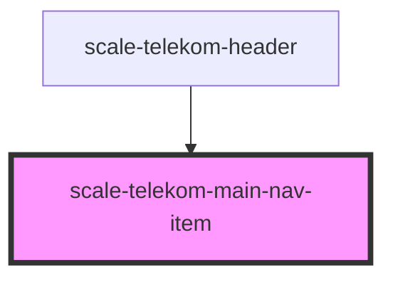

# scale-telekom-main-nav-item

<!-- Auto Generated Below -->

## Properties

| Property   | Attribute  | Description | Type      | Default                 |
| ---------- | ---------- | ----------- | --------- | ----------------------- |
| `current`  | `current`  |             | `boolean` | `undefined`             |
| `expanded` | `expanded` |             | `boolean` | `undefined`             |
| `label`    | `label`    |             | `string`  | `undefined`             |
| `to`       | `to`       |             | `string`  | `'javascript:void(0);'` |

## Events

| Event                                    | Description | Type               |
| ---------------------------------------- | ----------- | ------------------ |
| `scale-telekom-main-nav-item-click`      |             | `CustomEvent<any>` |
| `scale-telekom-main-nav-item-focus`      |             | `CustomEvent<any>` |
| `scale-telekom-main-nav-item-mouseenter` |             | `CustomEvent<any>` |
| `scale-telekom-main-nav-item-mouseleave` |             | `CustomEvent<any>` |

## Shadow Parts

| Part     | Description |
| -------- | ----------- |
| `"base"` |             |
| `"link"` |             |

## Dependencies

### Used by

 - [scale-telekom-header](../telekom-header)

### Graph

----------------------------------------------

*Built with [StencilJS](https://stenciljs.com/)*
