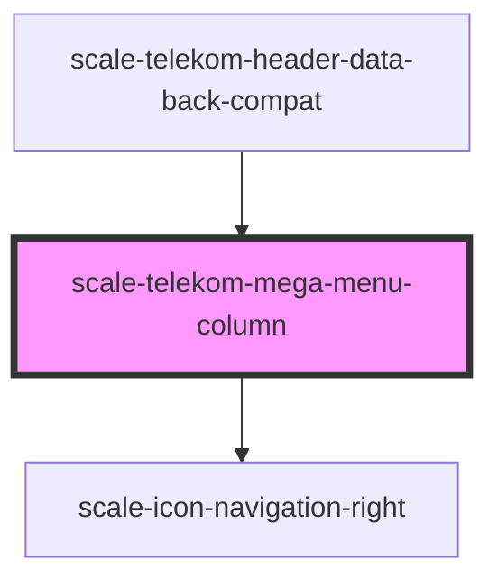

# scale-telekom-mega-menu-column


<!-- Auto Generated Below -->


## Overview

Usage example:

```html
 <scale-telekom-mega-menu-column>
   <scale-icon-home-home slot="icon"></scale-icon-home-home>
   <a href="#" slot="heading">My heading</a>
   <ul>
     <li><a href="#">Link One</a></li>
     <li><a href="#">Link Two</a></li>
     <li><a href="#">Link Three</a></li>
     <li><a href="#">Link Four</a></li>
   </ul>
 </scale-telekom-mega-menu-column>
```

## Properties

| Property       | Attribute       | Description | Type     | Default |
| -------------- | --------------- | ----------- | -------- | ------- |
| `headingLevel` | `heading-level` |             | `number` | `2`     |


## Shadow Parts

| Part                 | Description |
| -------------------- | ----------- |
| `"body"`             |             |
| `"heading"`          |             |
| `"icon"`             |             |
| `"icon-arrow-right"` |             |


## Dependencies

### Used by

 - [scale-telekom-header-data-back-compat](../telekom-header-data-back-compat)

### Depends on

- [scale-icon-navigation-right](../../icons/navigation-right)

### Graph


----------------------------------------------

*Built with [StencilJS](https://stenciljs.com/)*
