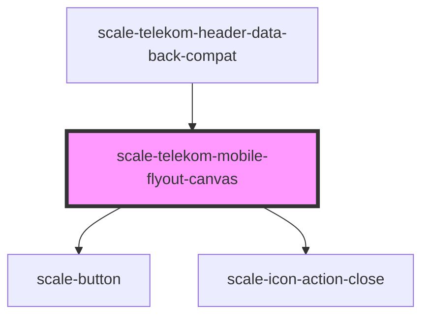

# scale-telekom-mobile-flyout-canvas

<!-- Auto Generated Below -->

## Properties

| Property           | Attribute            | Description | Type     | Default     |
| ------------------ | -------------------- | ----------- | -------- | ----------- |
| `appName`          | `app-name`           |             | `string` | `undefined` |
| `appNameClick`     | `app-name-click`     |             | `any`    | `undefined` |
| `appNameLink`      | `app-name-link`      |             | `string` | `undefined` |
| `closeButtonLabel` | `close-button-label` |             | `string` | `'Close'`   |
| `closeButtonTitle` | `close-button-title` |             | `string` | `null`      |

## Events

| Event                    | Description | Type               |
| ------------------------ | ----------- | ------------------ |
| `scale-close-nav-flyout` |             | `CustomEvent<any>` |

## Shadow Parts

| Part             | Description |
| ---------------- | ----------- |
| `"base"`         |             |
| `"body"`         |             |
| `"close-button"` |             |
| `"header"`       |             |
| `"heading"`      |             |
| `"meta"`         |             |

## Dependencies

### Used by

 - [scale-telekom-header-data-back-compat](../telekom-header-data-back-compat)

### Depends on

- [scale-button](../../button)
- [scale-icon-action-close](../../icons/action-close)

### Graph

----------------------------------------------

*Built with [StencilJS](https://stenciljs.com/)*
