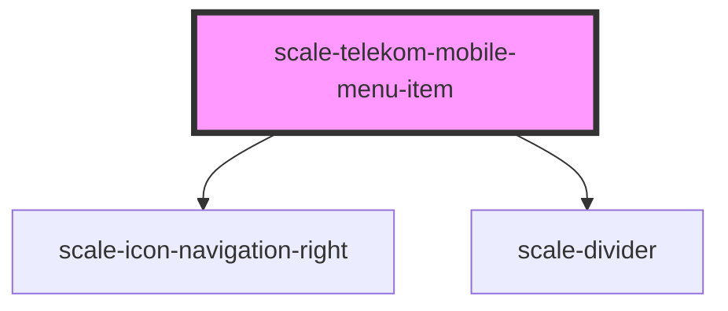

# scale-telekom-mobile-menu-item

<!-- Auto Generated Below -->

## Properties

| Property       | Attribute       | Description | Type      | Default |
| -------------- | --------------- | ----------- | --------- | ------- |
| `active`       | `active`        |             | `boolean` | `false` |
| `currentLevel` | `current-level` |             | `string`  | `'0'`   |
| `level`        | `level`         |             | `string`  | `'0'`   |
| `open`         | `open`          |             | `boolean` | `false` |

## Events

| Event                        | Description | Type               |
| ---------------------------- | ----------- | ------------------ |
| `scale-close-nav-flyout`     |             | `CustomEvent<any>` |
| `scale-set-menu-item-active` |             | `CustomEvent<any>` |
| `scale-set-menu-item-open`   |             | `CustomEvent<any>` |

## Shadow Parts

| Part                     | Description |
| ------------------------ | ----------- |
| `"icon-right-container"` |             |

## Dependencies

### Depends on

- [scale-icon-navigation-right](../../icons/navigation-right)
- [scale-divider](../../divider)

### Graph

----------------------------------------------

*Built with [StencilJS](https://stenciljs.com/)*
