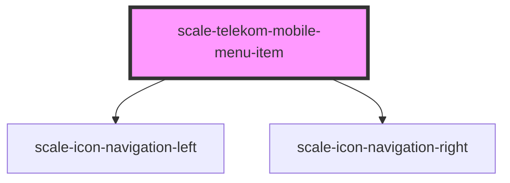

# scale-telekom-mobile-menu-item

<!-- Auto Generated Below -->

## Properties

| Property     | Attribute     | Description | Type      | Default |
| ------------ | ------------- | ----------- | --------- | ------- |
| `active`     | `active`      |             | `boolean` | `false` |
| `hideHeader` | `hide-header` |             | `boolean` | `false` |
| `level`      | `level`       |             | `string`  | `'0'`   |
| `open`       | `open`        |             | `boolean` | `false` |

## Events

| Event                   | Description | Type               |
| ----------------------- | ----------- | ------------------ |
| `scale-click-menu-item` |             | `CustomEvent<any>` |

## Shadow Parts

| Part                     | Description |
| ------------------------ | ----------- |
| `"icon-right-container"` |             |

## Dependencies

### Depends on

- [scale-icon-navigation-left](../../icons/navigation-left)
- [scale-icon-navigation-right](../../icons/navigation-right)

### Graph

----------------------------------------------

*Built with [StencilJS](https://stenciljs.com/)*
