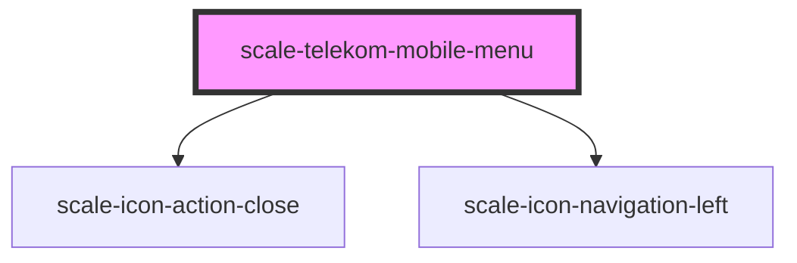

# scale-telekom-mobile-menu

<!-- Auto Generated Below -->

## Properties

| Property           | Attribute            | Description | Type     | Default     |
| ------------------ | -------------------- | ----------- | -------- | ----------- |
| `appName`          | `app-name`           |             | `string` | `undefined` |
| `appNameClick`     | `app-name-click`     |             | `any`    | `undefined` |
| `appNameLink`      | `app-name-link`      |             | `string` | `undefined` |
| `backButtonTitle`  | `back-button-title`  |             | `string` | `'Back'`    |
| `closeButtonTitle` | `close-button-title` |             | `string` | `'Close'`   |

## Events

| Event                    | Description | Type               |
| ------------------------ | ----------- | ------------------ |
| `scale-close-nav-flyout` |             | `CustomEvent<any>` |

## Shadow Parts

| Part             | Description |
| ---------------- | ----------- |
| `"app-name"`     |             |
| `"back-button"`  |             |
| `"base"`         |             |
| `"close-button"` |             |
| `"links-top"`    |             |
| `"nav"`          |             |

## Dependencies

### Depends on

- [scale-icon-action-close](../../icons/action-close)
- [scale-icon-navigation-left](../../icons/navigation-left)

### Graph

----------------------------------------------

*Built with [StencilJS](https://stenciljs.com/)*
