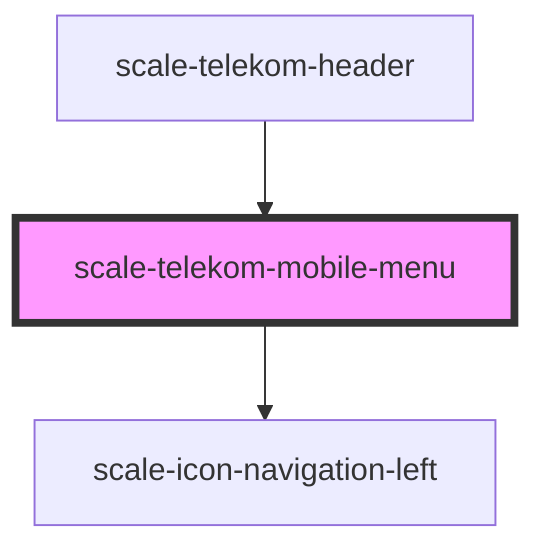

# scale-telekom-mobile-menu

<!-- Auto Generated Below -->

## Properties

| Property          | Attribute           | Description | Type     | Default     |
| ----------------- | ------------------- | ----------- | -------- | ----------- |
| `appName`         | `app-name`          |             | `string` | `undefined` |
| `appNameClick`    | `app-name-click`    |             | `any`    | `undefined` |
| `appNameLink`     | `app-name-link`     |             | `string` | `undefined` |
| `backButtonTitle` | `back-button-title` |             | `string` | `'Back'`    |

## Shadow Parts

| Part            | Description |
| --------------- | ----------- |
| `"back-button"` |             |
| `"base"`        |             |
| `"nav"`         |             |

## Dependencies

### Used by

 - [scale-telekom-header](../telekom-header)

### Depends on

- [scale-icon-navigation-left](../../icons/navigation-left)

### Graph

----------------------------------------------

*Built with [StencilJS](https://stenciljs.com/)*
