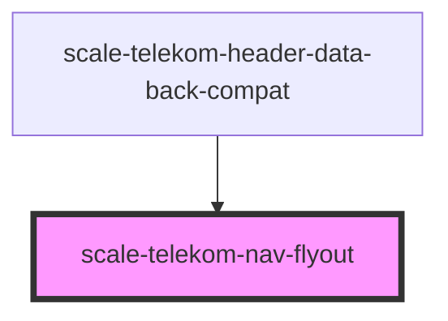

# scale-telekom-nav-flyout

<!-- Auto Generated Below -->

## Properties

| Property          | Attribute          | Description                                                                 | Type      | Default     |
| ----------------- | ------------------ | --------------------------------------------------------------------------- | --------- | ----------- |
| `expanded`        | `expanded`         | Open the flyout menu                                                        | `boolean` | `false`     |
| `hover`           | `hover`            | Whether the flyout should open on hover (needs better name!)                | `boolean` | `false`     |
| `triggerSelector` | `trigger-selector` | Selector to query the trigger element in case it's not the previous sibling | `string`  | `undefined` |

## Events

| Event            | Description | Type               |
| ---------------- | ----------- | ------------------ |
| `scale-expanded` |             | `CustomEvent<any>` |

## Methods

### `hide() => Promise<void>`

#### Returns

Type: `Promise<void>`

### `show() => Promise<void>`

#### Returns

Type: `Promise<void>`

## Dependencies

### Used by

 - [scale-telekom-header-data-back-compat](../telekom-header-data-back-compat)

### Graph

----------------------------------------------

*Built with [StencilJS](https://stenciljs.com/)*
