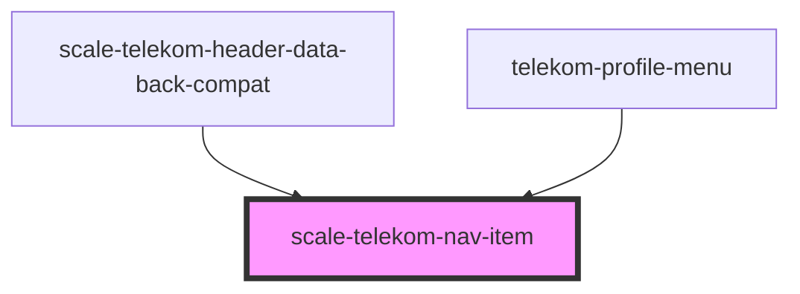

# scale-telekom-nav-item

<!-- Auto Generated Below -->

## Properties

| Property        | Attribute         | Description | Type                                                                                | Default      |
| --------------- | ----------------- | ----------- | ----------------------------------------------------------------------------------- | ------------ |
| `active`        | `active`          |             | `boolean`                                                                           | `false`      |
| `hideOnDesktop` | `hide-on-desktop` |             | `boolean`                                                                           | `false`      |
| `hideOnMobile`  | `hide-on-mobile`  |             | `boolean`                                                                           | `false`      |
| `role`          | `role`            |             | `string`                                                                            | `'none'`     |
| `variant`       | `variant`         |             | `"functions" \| "lang-switcher" \| "main-nav" \| "meta-nav" \| "meta-nav-external"` | `'main-nav'` |

## Dependencies

### Used by

 - [scale-telekom-header-data-back-compat](../telekom-header-data-back-compat)
 - [telekom-profile-menu](../profile-menu)

### Graph

----------------------------------------------

*Built with [StencilJS](https://stenciljs.com/)*
