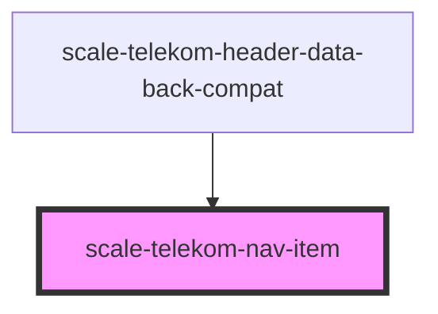

# scale-telekom-nav-item

<!-- Auto Generated Below -->

## Properties

| Property  | Attribute | Description | Type      | Default     |
| --------- | --------- | ----------- | --------- | ----------- |
| `active`  | `active`  |             | `boolean` | `false`     |
| `role`    | `role`    |             | `string`  | `'none'`    |
| `variant` | `variant` |             | `string`  | `undefined` |

## Dependencies

### Used by

 - [scale-telekom-header-data-back-compat](../telekom-header-data-back-compat)

### Graph

----------------------------------------------

*Built with [StencilJS](https://stenciljs.com/)*
