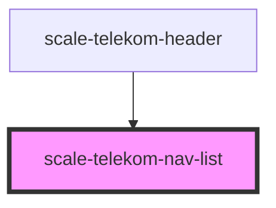

# scale-telekom-nav-list

<!-- Auto Generated Below -->

## Properties

| Property    | Attribute   | Description | Type                                                                                | Default      |
| ----------- | ----------- | ----------- | ----------------------------------------------------------------------------------- | ------------ |
| `alignment` | `alignment` |             | `"center" \| "left" \| "right"`                                                     | `'left'`     |
| `role`      | `role`      |             | `string`                                                                            | `'nav'`      |
| `variant`   | `variant`   |             | `"functions" \| "lang-switcher" \| "main-nav" \| "meta-nav" \| "meta-nav-external"` | `'main-nav'` |

## Dependencies

### Used by

 - [scale-telekom-header](../telekom-header)

### Graph

----------------------------------------------

*Built with [StencilJS](https://stenciljs.com/)*
