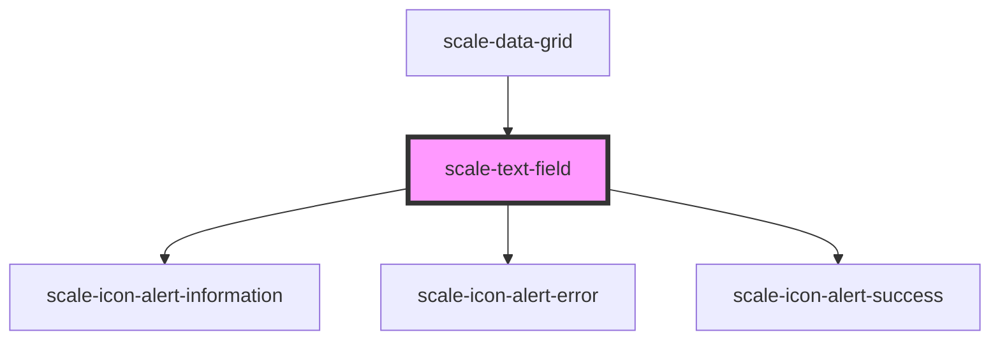

# scale-text-field

<!-- Auto Generated Below -->

## Properties

| Property                 | Attribute                 | Description                                                                                                     | Type                                                                                                                                     | Default           |
| ------------------------ | ------------------------- | --------------------------------------------------------------------------------------------------------------- | ---------------------------------------------------------------------------------------------------------------------------------------- | ----------------- |
| `counter`                | `counter`                 | (optional) Input counter                                                                                        | `boolean`                                                                                                                                | `undefined`       |
| `disabled`               | `disabled`                | (optional) Input disabled                                                                                       | `boolean`                                                                                                                                | `undefined`       |
| `experimentalControlled` | `experimental-controlled` | (optional)) Makes type `input` behave as a controlled component in React                                        | `boolean`                                                                                                                                | `false`           |
| `helperText`             | `helper-text`             | (optional) Input helper text                                                                                    | `string`                                                                                                                                 | `''`              |
| `inputAutofocus`         | `input-autofocus`         | (optional) the input should automatically get focus when the page loads.                                        | `boolean`                                                                                                                                | `undefined`       |
| `inputId`                | `input-id`                | (optional) Input checkbox id                                                                                    | `string`                                                                                                                                 | `undefined`       |
| `invalid`                | `invalid`                 | (optional) Input status                                                                                         | `boolean`                                                                                                                                | `false`           |
| `label`                  | `label`                   | Input label                                                                                                     | `string`                                                                                                                                 | `''`              |
| `list`                   | `list`                    | (optional) input list                                                                                           | `string`                                                                                                                                 | `undefined`       |
| `max`                    | `max`                     | (optional) define the numeric maximum value of input types such as month, date, time                            | `number`                                                                                                                                 | `undefined`       |
| `maxLength`              | `max-length`              | (optional) Input text string max length                                                                         | `number`                                                                                                                                 | `undefined`       |
| `min`                    | `min`                     | (optional) defines the numeric minimum value of input types such as month, date, time                           | `number`                                                                                                                                 | `undefined`       |
| `minLength`              | `min-length`              | (optional) Input text string min length                                                                         | `number`                                                                                                                                 | `undefined`       |
| `name`                   | `name`                    | (optional) Input name                                                                                           | `string`                                                                                                                                 | `''`              |
| `placeholder`            | `placeholder`             | (optional) Input placeHolder                                                                                    | `string`                                                                                                                                 | `''`              |
| `readonly`               | `readonly`                | (optional) Input readonly                                                                                       | `boolean`                                                                                                                                | `undefined`       |
| `required`               | `required`                | (optional) Input required                                                                                       | `boolean`                                                                                                                                | `undefined`       |
| `size`                   | `size`                    | **[DEPRECATED]** - css overwrite should replace size                     | `string`                                                                                                                                 | `undefined`       |
| `status`                 | `status`                  | **[DEPRECATED]** - invalid should replace status                         | `string`                                                                                                                                 | `''`              |
| `step`                   | `step`                    | (optional) the step attribute specifies the interval between legal numbers in an <input type="number"> element. | `string`                                                                                                                                 | `'1'`             |
| `styles`                 | `styles`                  | (optional) Injected CSS styles                                                                                  | `string`                                                                                                                                 | `undefined`       |
| `transparent`            | `transparent`             | (optional) input background transparent                                                                         | `boolean`                                                                                                                                | `undefined`       |
| `type`                   | `type`                    | (optional) Input type                                                                                           | `"date" \| "datetime-local" \| "email" \| "hidden" \| "month" \| "number" \| "password" \| "tel" \| "text" \| "time" \| "url" \| "week"` | `'text'`          |
| `value`                  | `value`                   | (optional) Input value                                                                                          | `number \| string`                                                                                                                       | `''`              |
| `variant`                | `variant`                 | (optional) Variant                                                                                              | `"danger" \| "informational" \| "success" \| "warning"`                                                                                  | `'informational'` |

## Events

| Event           | Description                                                                                        | Type                                  |
| --------------- | -------------------------------------------------------------------------------------------------- | ------------------------------------- |
| `scale-blur`    | Emitted when the input loses focus.                                                                | `CustomEvent<void>`                   |
| `scale-change`  | Emitted when the value has changed.                                                                | `CustomEvent<InputChangeEventDetail>` |
| `scale-focus`   | Emitted when the input has focus.                                                                  | `CustomEvent<void>`                   |
| `scale-input`   | Emitted when a keyboard input occurred.                                                            | `CustomEvent<KeyboardEvent>`          |
| `scale-keydown` | Emitted on keydown.                                                                                | `CustomEvent<KeyboardEvent>`          |
| `scaleBlur`     | **[DEPRECATED]** in v3 in favor of kebab-case event names   | `CustomEvent<void>`                   |
| `scaleChange`   | **[DEPRECATED]** in v3 in favor of kebab-case event names   | `CustomEvent<InputChangeEventDetail>` |
| `scaleFocus`    | **[DEPRECATED]** in v3 in favor of kebab-case event names   | `CustomEvent<void>`                   |
| `scaleInput`    | **[DEPRECATED]** in v3 in favor of kebab-case event names   | `CustomEvent<KeyboardEvent>`          |
| `scaleKeydown`  | **[DEPRECATED]** in v3 in favor of kebab-case event names   | `CustomEvent<KeyboardEvent>`          |

## Dependencies

### Used by

 - [scale-data-grid](../data-grid)

### Depends on

- [scale-icon-alert-information](../icons/alert-information)
- [scale-icon-alert-error](../icons/alert-error)
- [scale-icon-alert-success](../icons/alert-success)

### Graph

----------------------------------------------

*Built with [StencilJS](https://stenciljs.com/)*
