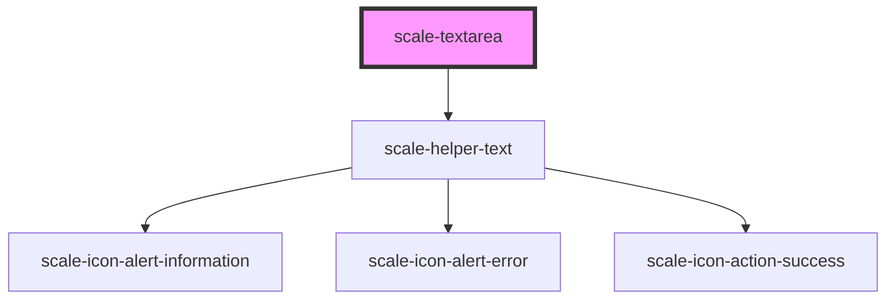

# scale-textarea

<!-- Auto Generated Below -->

## Properties

| Property         | Attribute         | Description                                                                                                      | Type                                                    | Default           |
| ---------------- | ----------------- | ---------------------------------------------------------------------------------------------------------------- | ------------------------------------------------------- | ----------------- |
| `ariaDetailsId`  | `aria-details-id` | (optional) id or space separated list of ids of elements that provide or link to additional related information. | `string`                                                | `undefined`       |
| `cols`           | `cols`            | (optional) textarea column                                                                                       | `number`                                                | `undefined`       |
| `counter`        | `counter`         | (optional) Input counter                                                                                         | `boolean`                                               | `undefined`       |
| `disabled`       | `disabled`        | (optional) Input disabled                                                                                        | `boolean`                                               | `undefined`       |
| `helperText`     | `helper-text`     | (optional) Input helper text                                                                                     | `string`                                                | `''`              |
| `inputAutofocus` | `input-autofocus` | (optional) the input should automatically get focus when the page loads.                                         | `boolean`                                               | `undefined`       |
| `inputId`        | `input-id`        | (optional) Input checkbox id                                                                                     | `string`                                                | `undefined`       |
| `invalid`        | `invalid`         | (optional) Input status                                                                                          | `boolean`                                               | `false`           |
| `label`          | `label`           | (optional) Input label                                                                                           | `string`                                                | `''`              |
| `maxLength`      | `max-length`      | (optional) Input max length                                                                                      | `number`                                                | `undefined`       |
| `minLength`      | `min-length`      | (optional) Input min length                                                                                      | `number`                                                | `undefined`       |
| `name`           | `name`            | (optional) Input name                                                                                            | `string`                                                | `''`              |
| `placeholder`    | `placeholder`     | (optional) Input placeHolder                                                                                     | `string`                                                | `''`              |
| `readonly`       | `readonly`        | (optional) Input readonly                                                                                        | `boolean`                                               | `undefined`       |
| `required`       | `required`        | (optional) Input required                                                                                        | `boolean`                                               | `undefined`       |
| `resize`         | `resize`          | (optional) textarea resize                                                                                       | `"horizontal" \| "none" \| "unset" \| "vertical"`       | `undefined`       |
| `rows`           | `rows`            | (optional) textarea row                                                                                          | `number`                                                | `undefined`       |
| `status`         | `status`          | **[DEPRECATED]** - invalid should replace status                          | `string`                                                | `''`              |
| `styles`         | `styles`          | (optional) Injected CSS styles                                                                                   | `string`                                                | `undefined`       |
| `transparent`    | `transparent`     | (optional) input background transparent                                                                          | `boolean`                                               | `undefined`       |
| `value`          | `value`           | (optional) Input value                                                                                           | `number \| string`                                      | `''`              |
| `variant`        | `variant`         | (optional) Variant                                                                                               | `"danger" \| "informational" \| "success" \| "warning"` | `'informational'` |

## Events

| Event           | Description                                                                                        | Type                                  |
| --------------- | -------------------------------------------------------------------------------------------------- | ------------------------------------- |
| `scale-blur`    | Emitted when the input loses focus.                                                                | `CustomEvent<void>`                   |
| `scale-change`  | Emitted when the value has changed.                                                                | `CustomEvent<InputChangeEventDetail>` |
| `scale-focus`   | Emitted when the input has focus.                                                                  | `CustomEvent<void>`                   |
| `scale-input`   | Emitted when a keyboard input occurred.                                                            | `CustomEvent<KeyboardEvent>`          |
| `scale-keydown` | Emitted on keydown.                                                                                | `CustomEvent<KeyboardEvent>`          |
| `scaleBlur`     | **[DEPRECATED]** in v3 in favor of kebab-case event names   | `CustomEvent<void>`                   |
| `scaleChange`   | **[DEPRECATED]** in v3 in favor of kebab-case event names   | `CustomEvent<InputChangeEventDetail>` |
| `scaleFocus`    | **[DEPRECATED]** in v3 in favor of kebab-case event names   | `CustomEvent<void>`                   |
| `scaleInput`    | **[DEPRECATED]** in v3 in favor of kebab-case event names   | `CustomEvent<KeyboardEvent>`          |
| `scaleKeyDown`  | **[DEPRECATED]** in v3 in favor of kebab-case event names   | `CustomEvent<KeyboardEvent>`          |

## Dependencies

### Depends on

- [scale-helper-text](../helper-text)

### Graph

----------------------------------------------

*Built with [StencilJS](https://stenciljs.com/)*
