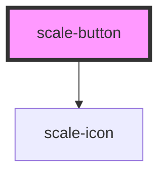

# scale-button

<!-- Auto Generated Below -->

## Usage

### Button

### Default

<scale-button>
  Hello
</scale-button>

### Button-accessibility

### Aria label

<scale-button aria-label="label">
  Label
</scale-button>

### Focusable

<scale-button focusable="false">
  Label
</scale-button>

### Button-disabled

### Disabled

<scale-button disabled>
  Label
</scale-button>

### Button-icon

### Icon before

<scale-button icon-before="M16.471,8.321 L12.613594,0.502886112 L8.755,8.321 L0.126435258,9.57533801 L6.37,15.66 L4.89610548,24.2548735 L12.613,20.197 L20.3310826,24.2548735 L18.856,15.66 L25.1007528,9.57533801 L16.471,8.321 Z M9.41891527,9.23556376 L12.613,2.761 L15.8082728,9.23556376 L22.951,10.273 L17.7826928,15.3122039 L19.003,22.427 L12.613594,19.067774 L6.223,22.427 L7.44449521,15.3122039 L2.275,10.273 L9.41891527,9.23556376 Z">
  Label
</scale-button>

### Icon after

<scale-button icon-after="M16.471,8.321 L12.613594,0.502886112 L8.755,8.321 L0.126435258,9.57533801 L6.37,15.66 L4.89610548,24.2548735 L12.613,20.197 L20.3310826,24.2548735 L18.856,15.66 L25.1007528,9.57533801 L16.471,8.321 Z M9.41891527,9.23556376 L12.613,2.761 L15.8082728,9.23556376 L22.951,10.273 L17.7826928,15.3122039 L19.003,22.427 L12.613594,19.067774 L6.223,22.427 L7.44449521,15.3122039 L2.275,10.273 L9.41891527,9.23556376 Z">
  Label
</scale-button>

### Icon only

<scale-button icon="M16.471,8.321 L12.613594,0.502886112 L8.755,8.321 L0.126435258,9.57533801 L6.37,15.66 L4.89610548,24.2548735 L12.613,20.197 L20.3310826,24.2548735 L18.856,15.66 L25.1007528,9.57533801 L16.471,8.321 Z M9.41891527,9.23556376 L12.613,2.761 L15.8082728,9.23556376 L22.951,10.273 L17.7826928,15.3122039 L19.003,22.427 L12.613594,19.067774 L6.223,22.427 L7.44449521,15.3122039 L2.275,10.273 L9.41891527,9.23556376 Z">
</scale-button>

### Icon size

<scale-button icon-size="12" icon="M16.471,8.321 L12.613594,0.502886112 L8.755,8.321 L0.126435258,9.57533801 L6.37,15.66 L4.89610548,24.2548735 L12.613,20.197 L20.3310826,24.2548735 L18.856,15.66 L25.1007528,9.57533801 L16.471,8.321 Z M9.41891527,9.23556376 L12.613,2.761 L15.8082728,9.23556376 L22.951,10.273 L17.7826928,15.3122039 L19.003,22.427 L12.613594,19.067774 L6.223,22.427 L7.44449521,15.3122039 L2.275,10.273 L9.41891527,9.23556376 Z">
</scale-button>

### Button-link

### Link

<scale-button href="http://example.com" target="_blank">
  Label
</scale-button>

### Button-small

### Small

<scale-button size="small">
  Label
</scale-button>

### Button-variant

## Variants
### primary

<scale-button variant="primary">
  Hello
</scale-button>

### secondary

<scale-button variant="secondary">
  Hello
</scale-button>

### error

<scale-button variant="error">
  Hello
</scale-button>

### warning

<scale-button variant="warning">
  Hello
</scale-button>

### info

<scale-button variant="info">
  Hello
</scale-button>

### success

<scale-button variant="success">
  Hello
</scale-button>

### custom

  
  <scale-button variant="custom">
    Hello
  </scale-button>

## Properties

| Property      | Attribute      | Description                    | Type                                     | Default     |
| ------------- | -------------- | ------------------------------ | ---------------------------------------- | ----------- |
| `ariaLabel`   | `aria-label`   |                                | `string`                                 | `''`        |
| `customClass` | `custom-class` | (optional) Button class        | `string`                                 | `''`        |
| `disabled`    | `disabled`     | (optional) Disabled button     | `boolean`                                | `false`     |
| `focusable`   | `focusable`    |                                | `boolean`                                | `true`      |
| `href`        | `href`         | (optional) Link button         | `string`                                 | `''`        |
| `icon`        | `icon`         | (optional) Icon only           | `string`                                 | `undefined` |
| `iconAfter`   | `icon-after`   | (optional) Icon after          | `string`                                 | `undefined` |
| `iconBefore`  | `icon-before`  | (optional) Icon before         | `string`                                 | `undefined` |
| `iconSize`    | `icon-size`    | (optional) Icon only           | `number`                                 | `24`        |
| `role`        | `role`         |                                | `string`                                 | `''`        |
| `size`        | `size`         | (optional) Button size         | `string`                                 | `''`        |
| `styles`      | --             | (optional) Injected jss styles | `StyleSheet<string \| number \| symbol>` | `undefined` |
| `target`      | `target`       | (optional) Link target button  | `string`                                 | `'_self'`   |
| `variant`     | `variant`      | (optional) Button variant      | `string`                                 | `''`        |

## Methods

### `disable() => Promise<void>`

Button method: disable()

#### Returns

Type: `Promise<void>`

### `enable() => Promise<void>`

Button method: enable()

#### Returns

Type: `Promise<void>`

## Dependencies

### Depends on

- [scale-icon](../icon)

### Graph

----------------------------------------------

*Built with [StencilJS](https://stenciljs.com/)*
