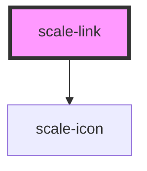

# scale-link

<!-- Auto Generated Below -->

## Properties

| Property      | Attribute      | Description                    | Type                                     | Default     |
| ------------- | -------------- | ------------------------------ | ---------------------------------------- | ----------- |
| `block`       | `block`        | (optional) Block link          | `boolean`                                | `false`     |
| `customClass` | `custom-class` | (optional) Link class          | `string`                                 | `''`        |
| `disabled`    | `disabled`     | (optional) Disabled link       | `boolean`                                | `false`     |
| `href`        | `href`         | (optional) Link href           | `string`                                 | `undefined` |
| `icon`        | `icon`         | (optional) Icon only           | `string`                                 | `undefined` |
| `iconSize`    | `icon-size`    | (optional) Icon size           | `number`                                 | `24`        |
| `styles`      | --             | (optional) Injected jss styles | `StyleSheet<string \| number \| symbol>` | `undefined` |
| `target`      | `target`       | (optional) Link open a new tag | `string`                                 | `'_self'`   |
| `underline`   | `underline`    | (optional) Link underline      | `boolean`                                | `true`      |
| `variant`     | `variant`      | (optional) Link variant        | `string`                                 | `''`        |

## Dependencies

### Depends on

- [scale-icon](../icon)

### Graph

----------------------------------------------

*Built with [StencilJS](https://stenciljs.com/)*
