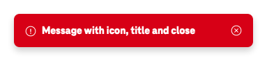
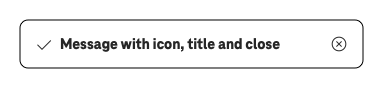
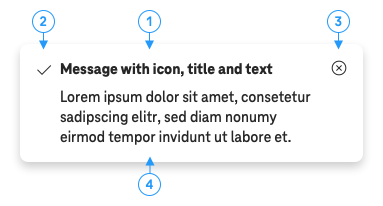

# Alertbox

Alertboxes are contextual notifications to the user. They stand out visually from the rest of the page so that the user can recognize and read them as directly and easily as possible.

## General

### When to Use

Alertboxes are used to draw the user's attention to information specific to the current context. For example, an error when entering data into a form.

### When Not to Use

Messages that are more global in nature, i.e. not directly related to the content of the current page, should be displayed as a global notification.

## Variants

### Floating / Shadow

Use the floating variant only if the alertbox is fixed, i.e. not scrolled with the content page.

### Plain

Use the plain variant if the contrast of the alertbox to the background is sufficient even without an outline.

### Outline

Use the outline variant if the contrast of the alertbox to the background is too low.

## Colors

### White

### Black

### Red / Error

The red alertbox is not available as an outline version as it is not intended to be placed on a red background.

## Sizes

### Large

Large is the default size.

### Small

Due to poor legibility, use the small size in exceptional cases only.

## Elements

### Title (1)

### Icon (2) (optional)

### Close Icon (3) (optional)

### Content (4) (optional)

The content can consist of almost all types of elements e.g. links, pictures. However, keep complexity limited in order to ensure good comprehensibility.
