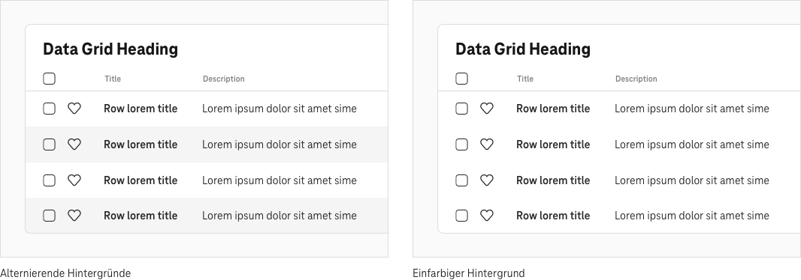
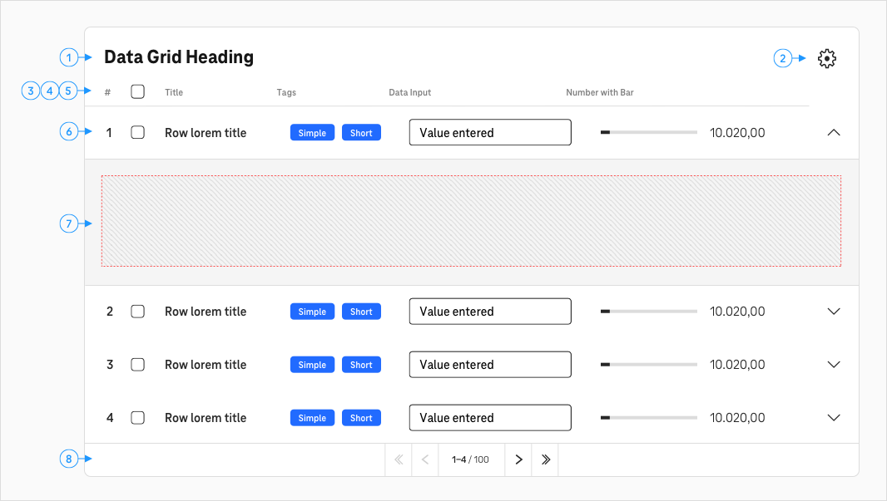

    <h1>Data Grid</h1>
    

Data Grids helfen Nutzer\*innen, komplexe Daten zu erfassen und zu verwalten.

## Allgemein

Data Grids sind ein erweiterter Tabellentyp. Zusätzlich zu den Standardfunktionen Filtern und Sortieren kann ein Data Grid viele weitere Funktionen enthalten, zum Beispiel Sortieren, Alles aus- oder abwählen, Ein- und Ausblenden sowie Exportieren.

### Verwende ein Data Grid, um

- Daten so zu organisieren, dass Nutzer\*innen sie leicht verstehen, analysieren und vergleichen können und
- zusätzliche Funktionen bereitzustellen, mit denen Nutzer\*innen mit den Daten interagieren können.

### Verwende Data Grids besser nicht, wenn

- die Komplexität der einzelnen Daten und Funktionen mit einer Tabelle nicht abbildbar ist oder
- du die zusätzlichen Funktionen nicht benötigst.

## Zeilenhintergründe

Um die Lesbarkeit der Inhalte zu erhöhen, kannst du alternierende Hintergründe einsetzen.

## Elemente

Innerhalb des Data Grid Frameworks kannst du eine Auswahl bestehender Komponenten frei kombinieren, um eine breite Palette von Anwendungsfällen zu berücksichtigen.

#### Heading (1)

Der kurze Titel beschreibt den Inhalt in klaren und einfachen Worten.

### Menü (2)

Das Menü umfasst Funktionen, wie zum Beispiel Sortieren, Alles aus- oder abwählen, Ein- und Ausblenden und Exportieren.

#### Nummerierung (3)

Wenn du die Nummerierung aktivierst, werden alle Zeilen automatisch durchnummeriert, beginnend bei 1.

#### Checkbox (4)

Aktivierst du die Checkbox, dann können Nutzer\*innen einige oder alle Tabellensätze für die Stapelverarbeitung auswählen, zum Beispiel um etwas zu archivieren, zu löschen oder als erledigt zu markieren.

#### Spalten-Titel (5)

Der Spalten-Header beschreibt den Inhalt der jeweiligen Spalte.

### Spalten-Titel (5)

Der Inhalt einer Zeile bildet eine Dateneinheit und unterscheidet sich sowohl inhaltlich als auch visuell von den anderen Zeilen. Der Zeilentitel enthält eine aussagekräftige Beschreibung des Datensatzes. Die anderen Zellen können die unterschiedlichsten Arten von Inhalten enthalten. Für eine bessere Lesbarkeit kannst du die Zeilen beim Mouseover hervorheben.

### HTML-Slot (7)

Füllst du den HTML-Slot in einer Tabellenzeile aus, wird am Ende der Zeile ein Expand-Icon hinzugefügt. Klicken/tippen Nutzer\*innen auf das Expand-Icon, blendet sich der HTML-Inhalt dieses Slots ein.

### Pagination (8)

Mithilfe der Pagination bewegen sich Nutzer\*innen gezielt durch den gesamten Datensatz.

## Datenkomponenten

Folgende Inhaltskomponenten kannst du in Data Grids einsetzen:

## Mobiles Verhalten

Auf mobilen Bildschirmen bricht die Datenzeile um und wird als separates Item angezeigt.

## Beta-Komponente

Diese Komponente befindet sich noch im Beta-Stadium. Wenn du sie testest, bedenke, dass sie möglicherweise noch nicht alle Qualitätskontrollmaßnahmen durchlaufen hat und noch keine WCAG-Zertifizierung zur Barrierefreiheit vorliegt. In Zukunft kann es zu Änderungen an dieser Komponente kommen.

## Verwandte Komponenten

[Table](?path=/usage/components-table)
