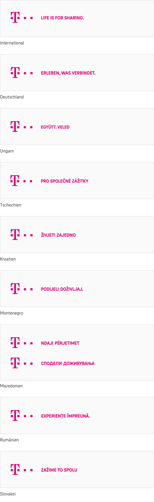
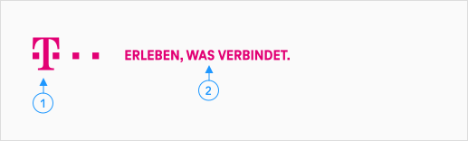
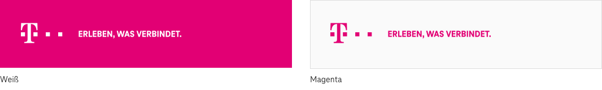

    <h1>Logo</h1>
    

Neben Farbe und Typografie ist das Logo eines der drei zentralen Telekom Gestaltungselemente. Auf Websites ist es in den Brand-Header sowie den Footer integriert und zeigt Nutzer\*innen auf einen Blick, wer der Absender ist.

## Allgemein

Wir setzen das Logo in Kombination mit dem Claim ein, um unser zentrales Markenversprechen zu vermitteln.
Verwende das Logo ausschließlich für den Brand-Header und Footer.

## Varianten

Das Telekom Logo mit Claim liegt in 9 länderspezifischen Varianten vor (für Deutschland, Ungarn, Tschechien, Kroatien, Montenegro, Mazedonien, Rumänien und Slovakei sowie als internationale Variante).

## Elemente

#### Logo (1)

#### Claim (2)

## Farben

## Beta-Komponente

Diese Komponente befindet sich noch im Beta-Stadium. Wenn du sie testest, bedenke, dass sie möglicherweise noch nicht alle Qualitätskontrollmaßnahmen durchlaufen hat und noch keine WCAG-Zertifizierung zur Barrierefreiheit vorliegt. In Zukunft kann es zu Änderungen an dieser Komponente kommen.

## Verwandte Komponenten

<a href="?path=/usage/components-brand-header-navigation--standard">Brand-Header, </a>
<a href="?path=/usage/components-footer--standard">Footer</a>
